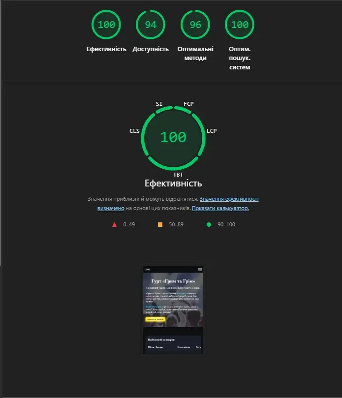

# Band “Hrym ta Hrim” – Landing Page
>This is a simple landing page built from a design mockup — just a side project to kill some free time and practice front-end coding.
The site represents the Ukrainian rock band “Hrym ta Hrim” – with powerful live music energy, band story, and concert schedule.

---

[Try it now]()

---

## Technologies

- **HTML5** 
- **CSS3**
- **JavaScript** 

---

### Screenshots

    
    
    
    

